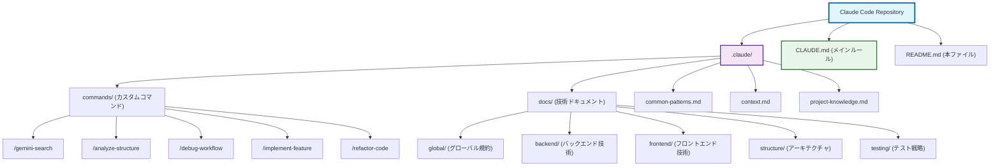
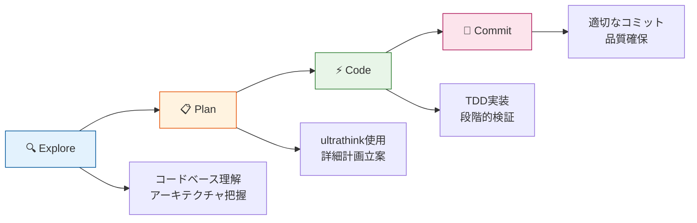
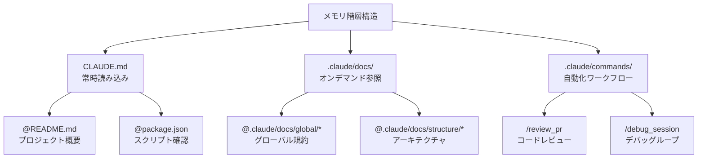
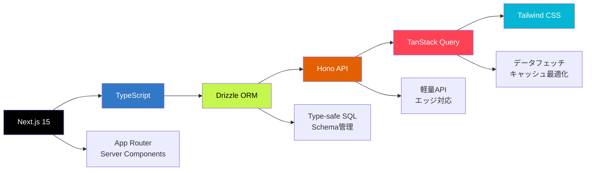

# Claude Code ベストプラクティス & ノウハウリポジトリ

このリポジトリは、**Claude Code**を使用した効率的な開発のためのベストプラクティス、設定ファイル、ナレッジベースを集約したものです。2024-2025年の最新Claude Codeベストプラクティスを完全統合し、生産性向上を実現します。

## 🎯 プロジェクト概要

**目的**: AI Rules Repository - Claude Code特化の開発環境最適化
**技術スタック**: Next.js 15 + TypeScript + Drizzle ORM + Hono + TanStack Query + Tailwind CSS
**生産性目標**: 45分タスク → 1パス完了の効率化実現

## 📂 リポジトリ構造



## 🚀 Claude Code 統合ワークフロー

### Explore-Plan-Code-Commit パターン



## 🎯 核となる最適化ポイント

### 1. **コンテキスト管理戦略**
- **`/clear`**: 新タスク開始時の完全コンテキストリセット
- **`/compact`**: 自然な区切りでのコンテキスト要約（手動推奨）
- **要約戦略**: 5Kトークン程度の事前マークダウン仕様書作成
- **チャンキング**: ディレクトリ単位での段階的作業分割

### 2. **メモリ階層活用**


### 3. **TDD最適化パターン**
1. **テスト先行指示**: 「TDDで進める」を明示してモック実装回避
2. **失敗確認**: テスト実行で期待通りの失敗を確認
3. **実装分離**: テスト修正禁止を徹底して設計保持
4. **段階的成功**: 全テスト通過まで反復的実装継続
5. **AIとTDDの親和性**: 幻覚対策とスコープドリフト防止に最適

## 🛠️ カスタムコマンド活用

`.claude/commands/`ディレクトリ内のカスタムコマンド例：

| コマンド | 用途 | 効果 |
|---------|------|------|
| `/review_pr` | PR向け体系的コードレビュー | 品質保証の自動化 |
| `/debug_session` | 構造化デバッグループ | 問題解決の効率化 |
| `/security_audit` | セキュリティ脆弱性スキャン | セキュリティ品質向上 |
| `/test_coverage` | テストカバレッジ分析 | テスト品質可視化 |
| `/performance_profile` | パフォーマンス分析 | 最適化提案生成 |

## 📈 パフォーマンス監視指標

- **生産性目標**: 45分タスク → 1パス完了の効率化実現
- **品質メトリクス**: テスト通過率100%・コード規約違反ゼロ維持
- **コスト効率化**: トークン消費監視・並列ツール実行活用
- **自動化率向上**: カスタムコマンドによる反復作業削減

## 🔧 技術スタック統合



## 🎓 ベストプラクティス

### Claude Code公式ガイダンス
- [Anthropic公式ドキュメント](https://docs.anthropic.com/en/docs/claude-code)
- [GitHub: awesome-claude-code](https://github.com/hesreallyhim/awesome-claude-code)
- [TDD with Claude Code](https://thenewstack.io/claude-code-and-the-art-of-test-driven-development/)

### 日本語コミュニティ知見
- [Zenn: Claude Code ベストプラクティス](https://zenn.dev/farstep/articles/claude-code-best-practices)
- [Zenn: 私のマイCLAUDE.md解説](https://zenn.dev/dirtyman/articles/ddbec05fd9fbb4)
- [Zenn: Claude Code 逆引きコマンド事典](https://zenn.dev/ml_bear/articles/84e92429698177)

## 🚦 クイックスタート

1. **リポジトリクローン**
```bash
git clone https://github.com/YunosukeYoshino/rules.git
cd rules
```

2. **CLAUDE.mdの確認**
```bash
cat CLAUDE.md  # メインルールファイル確認
```

3. **カスタムコマンドの活用**
```bash
# Claude Code起動後
/gemini-search "検索クエリ"  # Gemini検索
/analyze-structure           # プロジェクト構造分析
/implement-feature          # 機能実装ワークフロー
```

4. **プロジェクトへの適用**
```bash
# 自分のプロジェクトにCLAUDE.mdをコピー
cp CLAUDE.md /path/to/your/project/
cp -r .claude /path/to/your/project/
```

## 🤝 貢献ガイドライン

### 新しいベストプラクティス追加
1. `.claude/docs/`内の適切なカテゴリに配置
2. `CLAUDE.md`で統合ポイントを参照
3. 実証されたワークフローのみを含める
4. 日本語・英語併記を維持

### カスタムコマンド開発
1. `.claude/commands/`に新規Markdownファイル作成
2. `$ARGUMENTS`キーワードでパラメータ化
3. 再利用可能な形式で設計
4. 使用例とドキュメントを含める

## 📝 ライセンス

MIT License - 自由に使用、修正、配布可能

---

**🎯 目標**: Claude Code の力を最大限に活用し、開発生産性を革新的に向上させる
