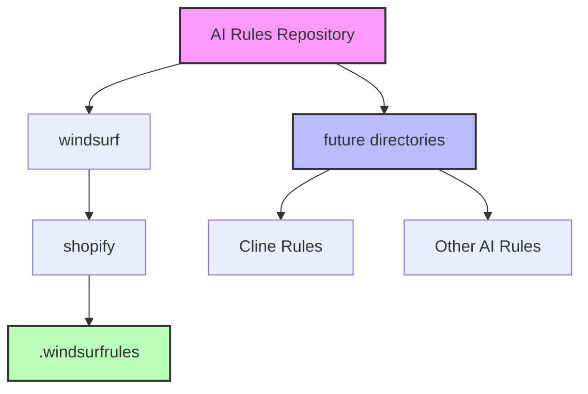
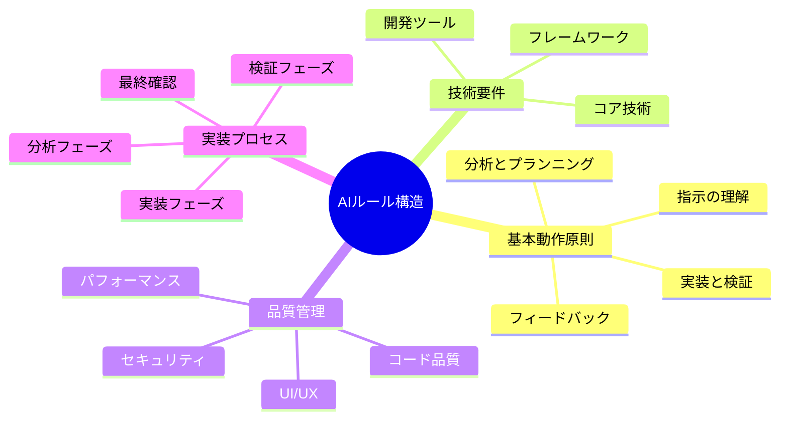
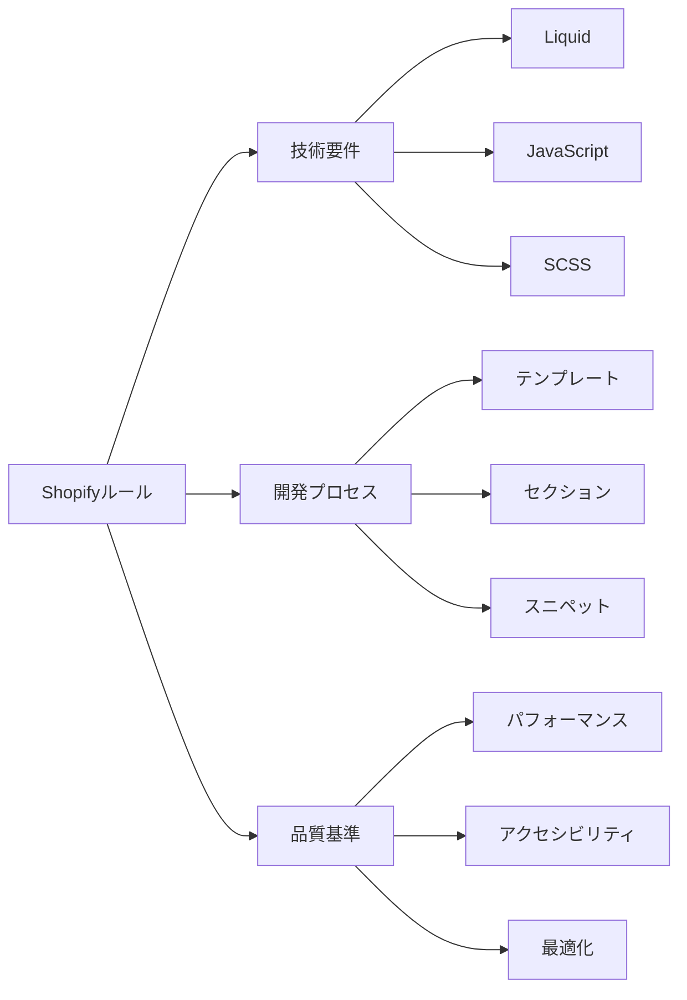
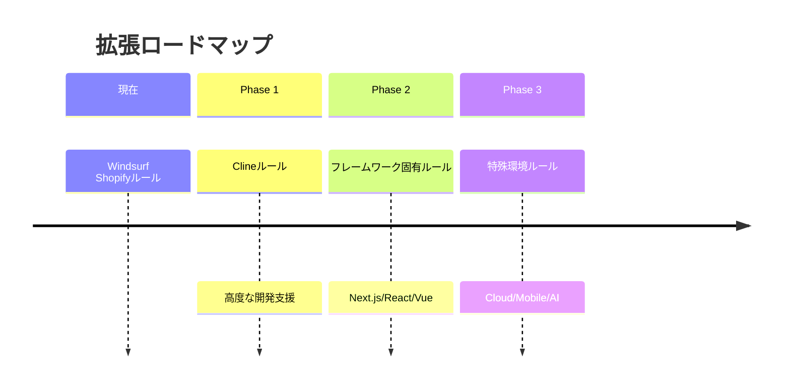
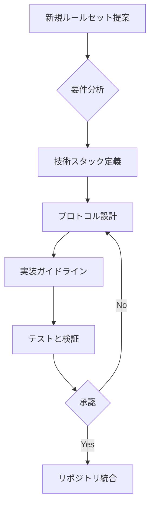

# AI ルールリポジトリ

このリポジトリは、様々なAIアシスタント用のルールセットを集めたものです。各開発環境やフレームワークに特化したAIアシスタンスを最適化することを目的としています。

## リポジトリ構造

## ルールセット構造

## 現在のルールセット

### Windsurf Shopifyルール
`windsurf/shopify/.windsurfrules` に配置

## 拡張計画

## ルールセットの実装プロトコル

## 貢献ガイドライン

新しいルールセットを追加する際は：
1. 既存のディレクトリ構造に従う
2. 包括的なドキュメントを含める
3. 一貫した形式を維持する
4. 複数のAI間での互換性を考慮する
5. AI固有のベストプラクティスに従う

