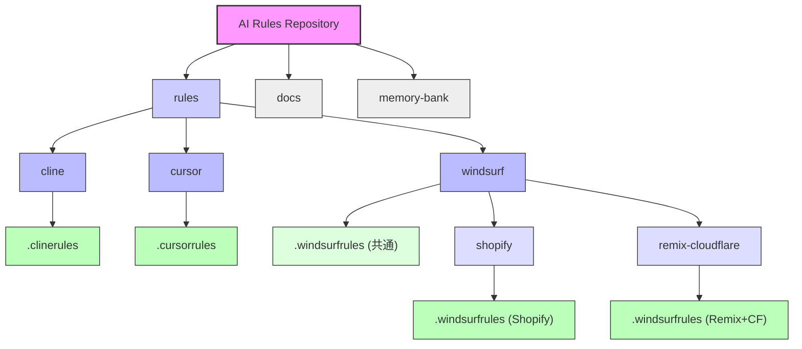
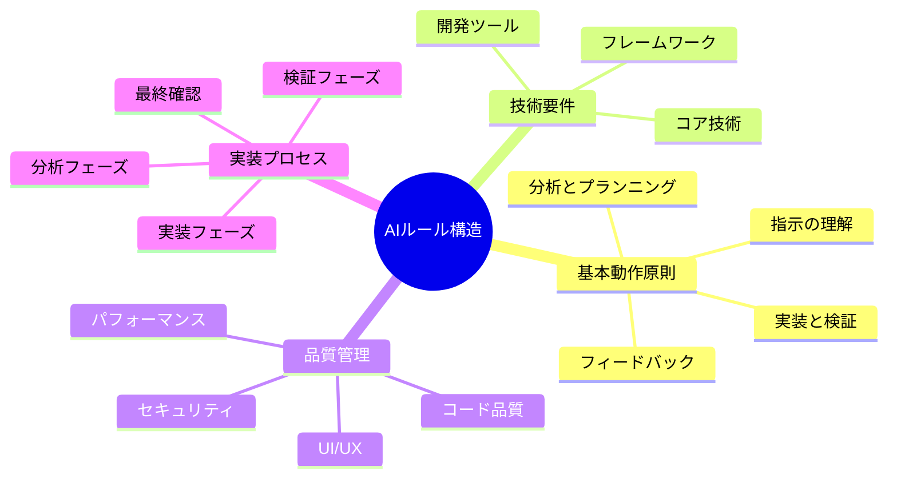
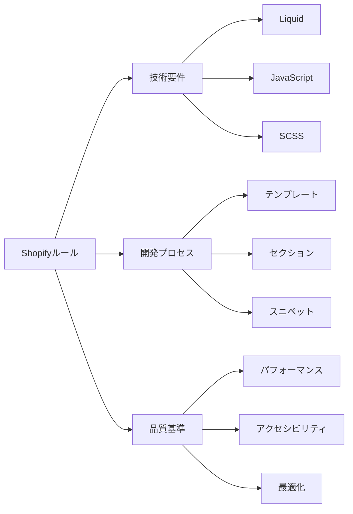
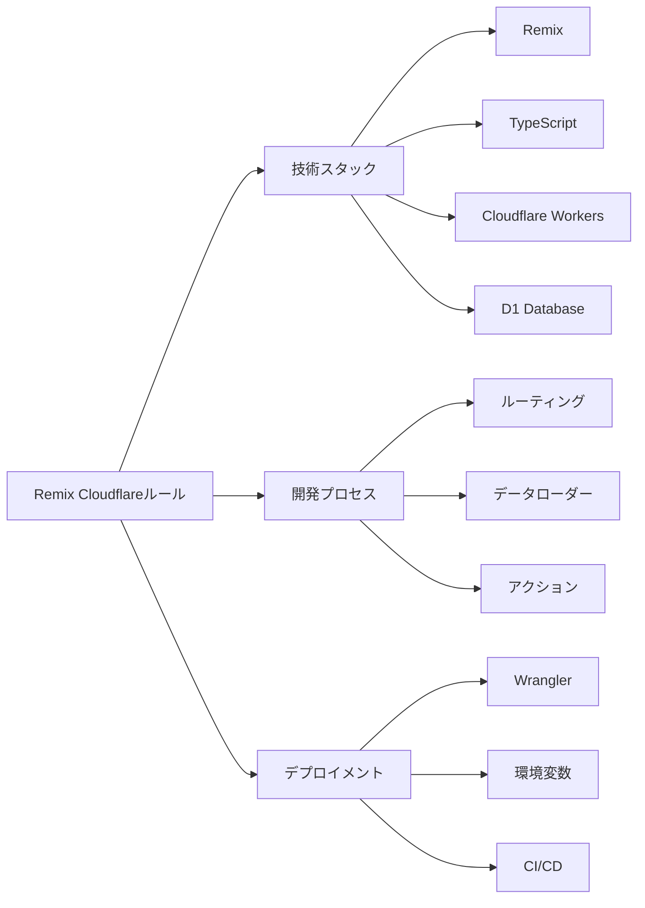
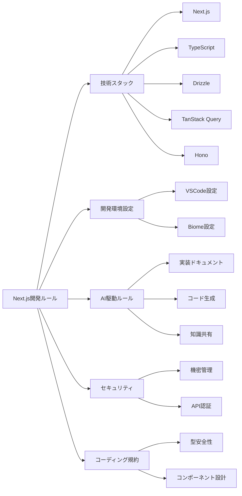
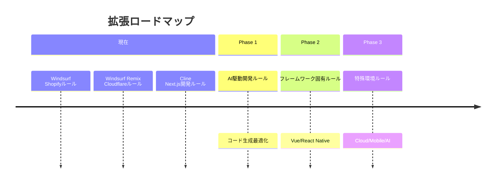
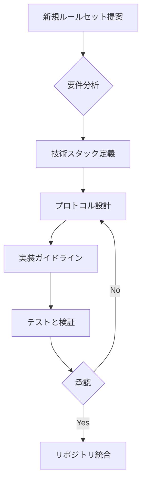

# AI ルールリポジトリ

このリポジトリは、様々なAIアシスタント用のルールセットを集めたものです。各開発環境やフレームワークに特化したAIアシスタンスを最適化することを目的としています。

## リポジトリ構造

## ルールセット構造

## 現在のルールセット

### Windsurf Shopifyルール
`windsurf/shopify/.windsurfrules` に配置

### Windsurf Remix Cloudflareルール
`windsurf/remix-cloudflare/.windsurfrules` に配置

### Cline Next.js開発ルール
`cline/.clinerules` に配置

## 拡張計画

## ルールセットの実装プロトコル

## 貢献ガイドライン

新しいルールセットを追加する際は：
1. 既存のディレクトリ構造に従う
2. 包括的なドキュメントを含める
3. 一貫した形式を維持する
4. 複数のAI間での互換性を考慮する
5. AI固有のベストプラクティスに従う

## AI アシスタント別の使用方法

### Cline
Cline AIアシスタントでは、`rules/cline/.clinerules` ファイルを直接参照して、特定の開発環境やフレームワークに最適化された支援を提供します。このファイルには、メモリバンクや関連ドキュメントへの参照、Cline固有の動作指示が含まれています。
- *使用方法*: プロンプトに「@cline rules/cline/.clinerules」を含めることで、定義されたルールセットを適用します。

### Cursor
Cursor AIアシスタント（コード編集特化）では、`rules/cursor/.cursorrules` ファイルを参照して、コーディング規約、プロジェクト構造、セキュリティガイドラインに基づいたコード編集やリファクタリングを行います。
- *使用方法*: (Cursorのルールファイル指定方法に従ってください。通常、プロジェクトルートに設定ファイルがあるか、設定で指定します。このリポジトリのルールを適用するには、内容をCursorの設定に反映させるか、プロンプトで主要なルールを指示する必要があるかもしれません。)

### WindSurf
WindSurf AIアシスタントでは、プロジェクトに応じた `.windsurfrules` ファイルを使用して、特定の開発環境に特化した支援を受けられます。各プロジェクト用のルールファイルは、`rules/windsurf/.windsurfrules` にある共通ルールを継承（または内部にコピー）し、その上でプロジェクト固有の技術スタック、規約、制約を定義しています。
- *Shopify開発*: プロンプト内で「@windsurf rules/windsurf/shopify/.windsurfrules」を指定します。このファイルには共通ルールとShopify特化ルールの両方が含まれています。
- *Remix Cloudflare開発*: プロンプト内で「@windsurf rules/windsurf/remix-cloudflare/.windsurfrules」を指定します。このファイルには共通ルールとRemix+Cloudflare特化ルールの両方が含まれています。
- *(注意)*: AIによっては、複数のルールファイルを同時に参照できる場合があります。その場合は、共通ルール (`rules/windsurf/.windsurfrules`) と特化ルールを別々に指定することも可能です。上記は、特化ファイル内に共通ルールをコピーする前提での指示です。
